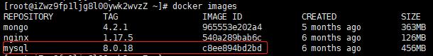
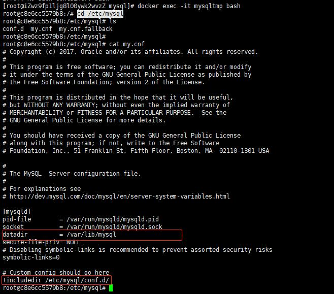
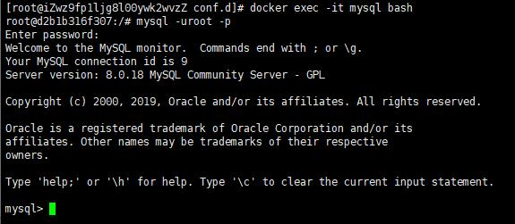

# 使用Docker安装MySQL

##  拉取MySQL镜像

```bash
docker pull mysql:8.0.18
```

拉取mysql8.0.18版本的镜像, 可以修改tag拉取其它版本的镜像

```bash
docker images
```

查看下载完成的镜像.



## 准备MySQL存储目录

这一步的目的是初始化MySQL配置文件, 创建MySQL存储目录, 防止容器被删后数据丢失.

### 创建目录

```bash
mkdir -p /app/mysql
cd /app/mysql
mkdir conf.d data
```

`/app/mysql/conf.d`: 配置文件目录

`/app/mysql/data `: mysql数据目录

### 初始化配置文件

```bash
docker run -p 3306:3306 --name mysqltmp -e MYSQL_ROOT_PASSWORD=1 -d mysql:8.0.18
docker ps -a
docker exec -it mysqltmp bash
```

1. 启动一个临时容器, 初始化配置文件内容, 后续会删掉这个容器, 
2. 查看容器启动
3. 进入容器, 在容器内部执行命令

```bash
cd /etc/mysql
ls
cat my.cnf
```

查看mysql默认配置信息和文件存放的位置



`datadir`: 数据存放目录

`includedir`: 导入其它配置文件

```bash
ls /etc/mysql/conf.d/
```

查看mysql导入的默认配置信息, 有两个文件, docker.cnf和mysql.cnf, 我们把`conf.d`这个目录拷贝到容器外部

在容器内部执行`exit`命令退出容器

### 拷贝配置文件

```bash
docker cp mysqltmp:/etc/mysql/conf.d /app/mysql/
```

拷贝容器中`/etc/mysql/conf.d`目录下的文件到`/app/mysql/conf.d`中, 注意最后一个`/`不能少

```bash
cd /app/mysql/conf.d
ll
```

查看文件是否拷贝成功.

### 删除临时容器

```bash
docker stop mysqltmp
docker rm mysqltmp
```

停止并删除临时容器

## 修改配置信息

有需要的可以修改`/app/mysql/conf.d/mysql.cnf`修改配置信息, 这里使用默认配置, 不做修改

## 启动MySQL容器

```bash
docker run --name mysql -p 3306:3306 \
-e MYSQL_ROOT_PASSWORD=1 \
-v /app/mysql/data:/var/lib/mysql \
-v /app/mysql/conf.d:/etc/mysql/conf.d \
-d mysql:8.0.18
```

`-p 3306:3306`: 端口映射

`-e MYSQL_ROOT_PASSWORD=1`: 设置mysql连接密码

`-v /app/mysql/data:/var/lib/mysql`: 映射本机mysql数据存储目录到容器中

`-v /app/mysql/conf.d:/etc/mysql/conf.d`: 映射本机配置目录到容器中

命令执行完成后, 会启动`name`为`mysql`的容器

```bash
docker ps -a
```

查看容器启动状态

## 验证MySQL启动

```docker exec -it mysql bash
docker exec -it mysql bash
mysqld -uroot -p
```

执行`docker exec`进入容器, 执行`mysqld`命令连接mysql, 输入密码后, 连接完成



## 开放防火墙端口

我们使用3306端口做为mysql连接端口, 为了使外部能连接数据库, 我们需要开放防火墙3306端口, 如果不需要外部连接, 可忽略这一步, 如果使用的是阿里云等云服务器, 还需要在云服务器上配置端口放行

```bash
firewall-cmd --zone=public --add-port=3306/tcp --permanent
firewall-cmd --reload
```